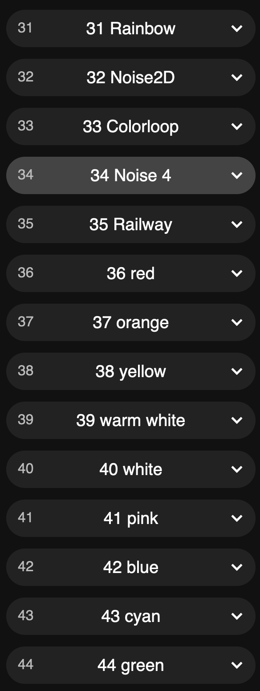

# Bärener Zyt GPS

## Konfiguration
### Buttons
Es gibt 3 Touch-Buttons die zum Konfigurieren der BärnerZyt zur verfügung stehen.

### 1. Farbe/Muster 
Dieser Button ist unten, unter den zwei linksten  Buchstaben.

Es gibt 5 Muster und 9 Farben die du ausgewählen kannst.

### 2. Helligkeit
Dieser Button ist unten unter den zwei mittleren Buchstaben.
Die Helligkeit kan in 3 Stuffen eingestellt werden.

### 3. Access Point «BaernerZytAP» einschalten
Dieser Button ist unten unter den zwei rechtensten Buchstaben.
Mit dem Button AP ein (zweites Minuten LED) berühren. Das LED sollte jetzt weiss leuchten.

Jetzt kann der «BaernerZytAP» mit einem PC oder Mobilgerät gefunden werden.

Eine Webseite wird angezeig. Falls nicht, im Web-Browser die Adresse http://4.3.2.1/ eingeben.

Falls du eine andere Farbe, Animation etc. willst kannst du hier alles einstellen.

Für weitere Informationen zu den Eintellungen https://www.youtube.com/watch?v=6eCE2BpLaUQ

Die Bärner Zyt ist ein Usermode der auf WLED https://kno.wled.ge/ aufbaut.

Die Projektseite findest du unter https://github.com/showrab/WLED

