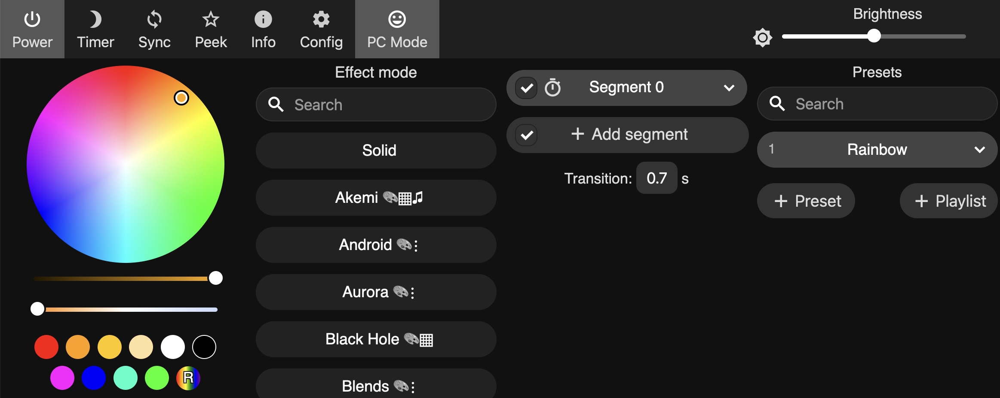

# Bärener Zyt GPS

## Configuration
### Buttons
There are 3 touch buttons to configure the BärnerZyt clock. The buttons are on top or bottom of the frame.

### 2. Color/Effect 
With this button you can chose between 5 effects and 9 colors.

### 3. Brightness
There are 3 brightnesses

### 1. Turn on/off Access Point «BaernerZytAP»
Dieser Button ist unten unter den zwei rechtensten Buchstaben.
Mit dem Button AP ein (zweites Minuten LED) berühren. Das LED sollte jetzt weiss leuchten.

Jetzt kann der «BaernerZytAP» mit einem PC oder Mobilgerät gefunden werden.

Eine Webseite wird angezeig. Falls nicht, im Web-Browser die Adresse http://4.3.2.1/ eingeben.

Falls du eine andere Farbe, Animation etc. willst kannst du hier alles einstellen.

Für weitere Informationen zu den Eintellungen https://www.youtube.com/watch?v=6eCE2BpLaUQ

Die Bärner Zyt ist ein Usermode der auf WLED https://kno.wled.ge/ aufbaut.

Die Projektseite findest du unter https://github.com/showrab/WLED

