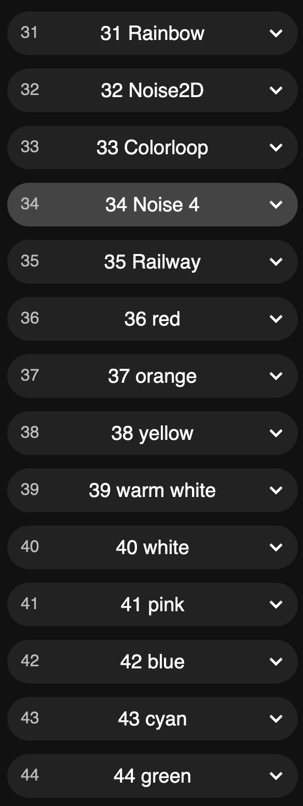

# Baerener Zyt GPS
This Baerner Zyt has a GPS-Module built in, to get the exact time.

To initialisze the GPS modul, you should turn the watch on under the open sky. Afterwards it also schould work indors.

## Configuration
### Buttons
There are 3 touch buttons to configure the BärnerZyt clock. The buttons are on top or bottom of the frame.

#### 1. Turn on/off Access Point «BaernerZytAP»
First button turns the WiFi Acces Point on/off. The LED above or under the button lights up in white when Wifi Acces Point is on.

Now you can connecht your celurar phone or computer with the access point WLED-AP or BaernerZytAP. 

The WLED configuration page should pop up, if not you can open the page in the browser with http://4.3.2.1/ .

Here you can choose other colors or effects. 

For more informations about the settingst see https://www.youtube.com/watch?v=6eCE2BpLaUQ

This Bärner Zyt is based on a usermode of WLED. The project page of this usermode is https://github.com/showrab/WLED

The WLED project you can find here https://kno.wled.ge/

#### 2. Color/Effect 
With this button you can chose between 5 effects and 9 colors, you can cycle through.

#### 3. Brightness
There are 3 brightnesses, you can cycle through.

