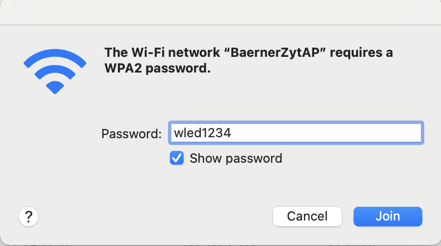
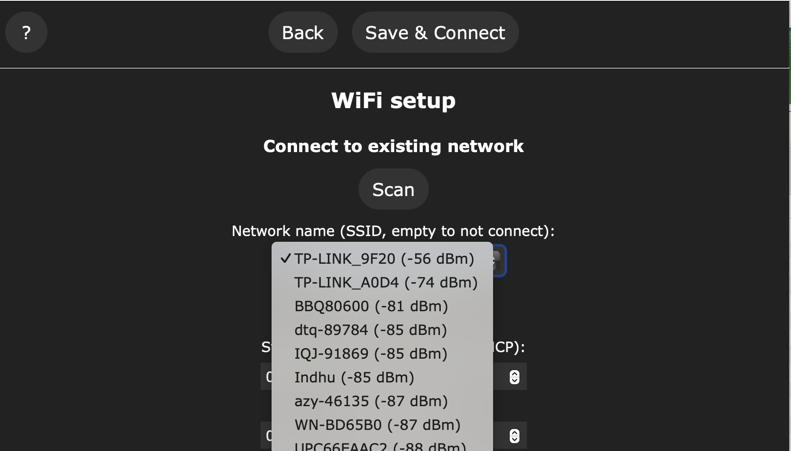
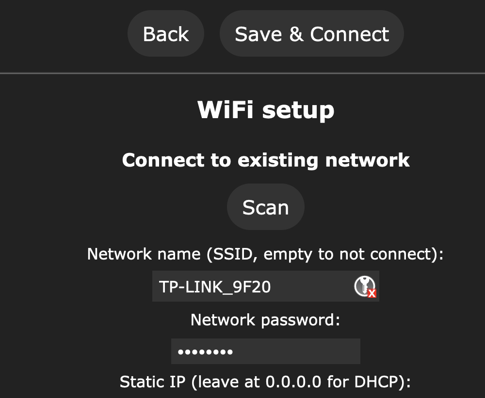
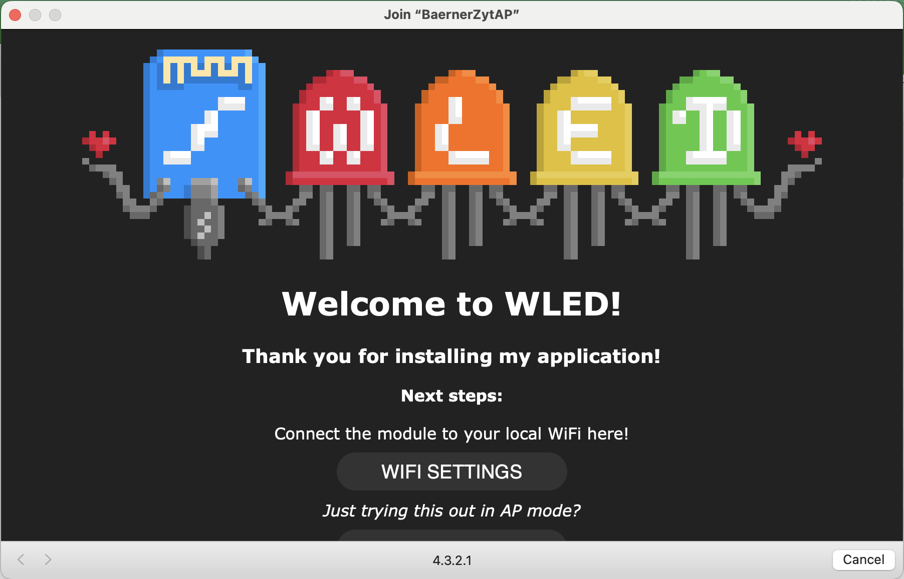

# Bärener Zyt

## Konfiguration

WiFi Netzwerk «BaernerZytAP» suchen und auswählen.

Eine Webseite wird angezeig. Falls nicht, im Web-Browser die Adresse http://4.3.2.1/ eingeben.

Hier kann in den «WIFI SETTINGS» der eigene Router mit «SCAN» gesucht werden

Im Feld «Network password» WiFi-Passwort vom eigenen Router eingeben und mit «Save & Connect» speichern. Ab jetzt sollte die richtige Zeit angezeigt werden. 

Die Bärner Zyt ist jetzt mit deinem Router verbunden und kann über die Adresse http://BaernerZyt.local/ konfiguriert werden. Falls du eine andere Farbe, Animation etc. willst kannst du hier alles einstellen.

Für weitere Informationen zu den Eintellungen https://www.youtube.com/watch?v=6eCE2BpLaUQ

Die Bärner Zyt ist ein Usermode der auf WLED https://kno.wled.ge/ aufbaut.
Die Projektseite findest du unter https://github.com/showrab/WLED

