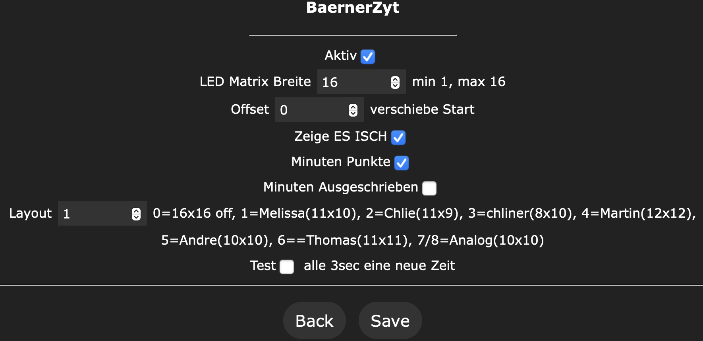

# Bärner Zyt (Word Clock) Usermod V2

This usermod drives an max 16x16 pixel matrix wordclock with WLED. There are 4 additional dots for the minutes. 

The visualisation is described by 4 masks with LED numbers (single dots for minutes, minutes, hours). 

The index of the LEDs in the masks always starts at 0, even if the ledOffset is not 0.

These are the parameters that controls the behavior in the WLED :
 
* active: enable/disable usermod
* matrixCols: width of the matrix (this alows to show a small layout on a larger matrix)
* ledOffset: number of LEDs before the wordclock LEDs
* dyplay It Is: enable/disable display of "Es ist" on the clock
* minuteDots: show up to 4 dots to see exact minutes between the five minutes
* minuteWords: say the minutes between the five minutes in words (scho fasch füf ab drü)
* layout: Number of the layout
* test: Test mode to test the layouts with fast changing numbers

## WiFi Configuration
Description on how to [connect your Bärner-Zyt to your Router](WiFiSetup_de.md) or scann this QR-Code.

## Layouts

in the file layouts.h there are already defined some layouts
To define a new layout increment MAX_LAYOUTS by one, copy a already defined layout and coppy everything to the end. Change on all #defines the layout number (#define LAYOUT_COLS_1 -> #define LAYOUT_COLS_8)

In File zyt-macros.h add new line every where you find a //insert new layout here

To end the words on a array add -1 
## Installation

* `USERMOD_BAERNERZYT`   - define this to have this usermod included wled00\usermods_list.cpp
* `USERMOD_ID_BAERNERZYT - define this to have this usermod included wled00\const.h

### PlatformIO requirements

WLAN and NTP

## Change Log

2022/03/30 initial commit
