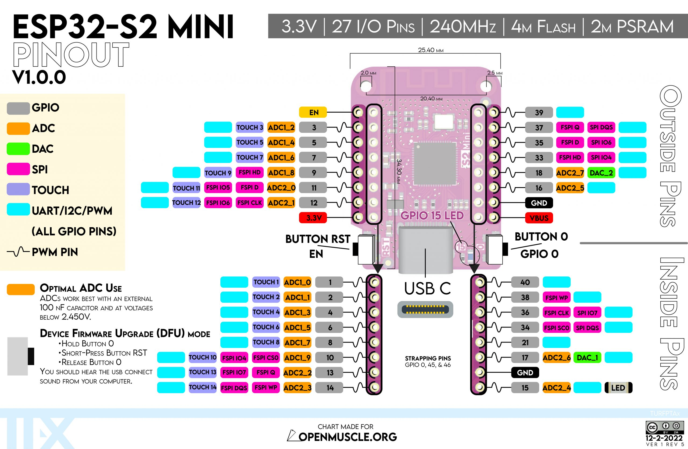
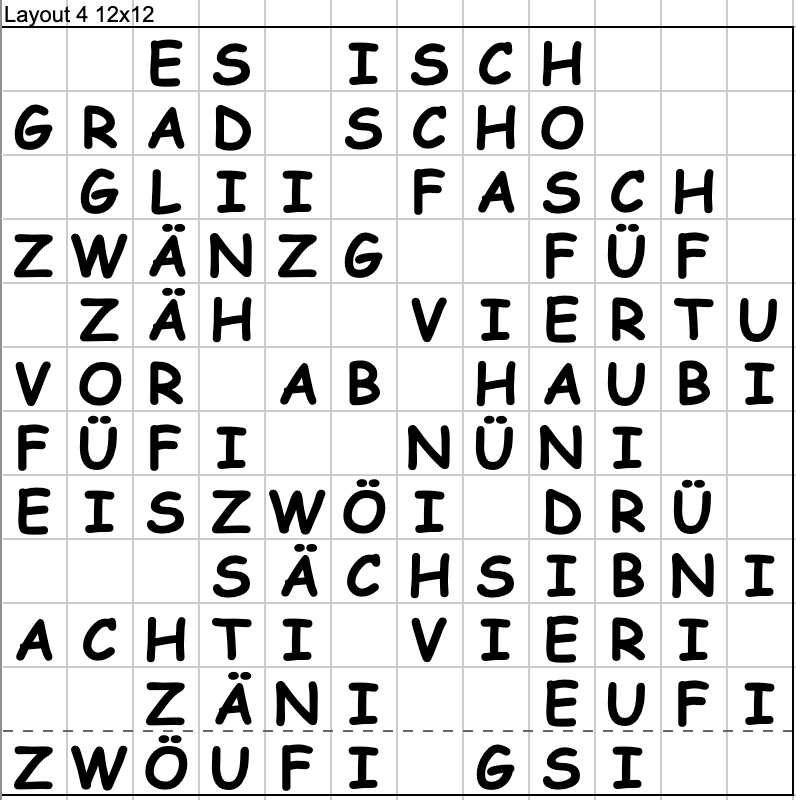

# Bärner Zyt (Word Clock) Usermod V2

This usermod drives an max 16x16 pixel matrix wordclock with WLED. There are 4 additional dots for the minutes. 


These are the parameters that controls the behavior of "Bärner Zyt" in the WLED Config -> Usermods menue:
 
* active: enable/disable usermod
* matrixCols: width of the matrix (this alows to show a small layout on a larger matrix)
* ledOffset: number of LEDs before the wordclock LEDs
* dyplay It Is: enable/disable display of "Es ist" on the clock
* minuteDots: show up to 4 dots to see exact minutes between the five minutes
* minuteWords: say the minutes between the five minutes in words (scho fasch füf ab drü)
* layout: Number of the layout
* test: Test mode to test the layouts with fast changing numbers

## Bärner-Zyt Configuration

* WiFi Setup
  * mDNS address: BaernerZyt
  * AP SSID: BaernerZytAP

* LED Preferences
  * Maximum Current: 1000mA
  * LED Type: WS281x
  * Color Order: GRB
  * Lenght: 114 (Layout 1: 10x11 +4) 
  * GPIO: 16
  * Button 0 GPIO: 0 Pushbutton //Button on ESP32 Board: LED ON/OFF
  * Button 1 GPIO: 13 Touch     //Macro presets 20: Brightness
  * Button 2 GPIO: 14 Touch     //Macro presets 30: Effect rotate

* 2D Configuration
  * Strip or panel: 2D Matrix
  * Number of panels: 2 (Layout 1 )
  * Panel 0
    * 1st LED: Bottom Right
    * Orientation: Horizontal
    * Serpentine: true
    * Dimension: 11x10
    * Offset: 0x0
  * Panel 1 (Layout 1)
    * 1st LED: Top Left
    * Orientation: Horizontal
    * Serpentine: true
    * Dimension: 4x1
    * Offset: 0x10
  * Time & Macros
    * Get time from NTP server: true //Sta-Mode,
    * Get time from NTP server: false //GPS           
    ch.pool.ntp.org
    * Use 24h format: true
    * Time zone: CET/CEST
    * Button actions
      |push switch|short|long|double|comment|
      |---|---|---|---|---|
      |Button 0| 0|||on ESP32 Board: ON/OFF|
      |Button 1|20|||Preset 20: rotate brightness|
      |Button 2|30|||Preset 30: rotate effects|
  * Usermods
    * BaernerZyt
      * Aktiv: true
      * LED Matrix Breite: 11 (depends on the layout)
      * Offset: 
      * Zeige ES ISCH: true
      * Minuten Punkte: true
      * Layout: 1
    * GPS Time Usermod
      * Enabled: true //Time from the GPS-Module
      * Pin: 18 //ESP32 RX-Pin zu GPS TX-Pin
      * Period: 3600s
    * AP-Mode Off Usermod
      * Enabled: true  //In AP-Mode turn off the AP-Mode
      * Pin: 4 
      * Touch Button: true  //Touch-Pins: 2,4,12,13,14,15,27,32,33
      * AP Mode On Pixel Pos: 113
* Security & Updates
  * Backup & Restore
    * Restore presets 
      * Browse: WLED/usermods/usermod_v2_baerner_zyt/settings/wled_presets.json Upload
    * Restore configuration
      * Browse: WLED/usermods/usermod_v2_baerner_zyt/settings/wled_cfg.json Upload
  
## Presets
* Brightness

  |Preset #|API command|
  |---|---|
  |20|P1=21;P2=23;PL=~|
  |21|{"bri":32}|
  |22|{"bri":64}|
  |23|{"bri":128}|

* Effects

  |Preset #|API command|
  |---|---|
  |30|P1=31&P2=44&PL=~|
  |31-35|Effekte|
  |36-44|Solid colors||

## WiFi Configuration
Description on how to [connect your Bärner-Zyt to your Router](WiFiSetup_de.md) or scann this QR-Code un the back of your "Bärner-Zyt" watch.


## GPS Configuration
If there is no internet or for an easier user interaction, you can connect a GPS-Module to the watch. With this QR-Code you find the User Description. 

In English: 


In German: 


## Layouts

The file [layouts.h](layouts.h) there are already defined some layouts.

To define a new layout increment MAX_LAYOUTS by one, copy a already defined layout and paste everything to the end. Change on all #defines the layout number (#define LAYOUT_COLS_1 -> #define LAYOUT_COLS_8)

In File [zyt-macros.h](zyt-macros.h) add new line every where you find a "//insert new layout here" and set the number to the number of your layout.

## Installation Usermode

### Insert some lines in `wled00\usermods_list.cpp` 

```
#define USERMOD_BAERNERZYT
``` 
to have this usermod included in WLED. There are more line you habe to insert in this file
```
#ifdef USERMOD_BAERNERZYT
  #include "../usermods/usermod_v2_baerner_zyt/usermod_v2_baerner_zyt.h"
#endif
```
and
```
 #ifdef USERMOD_BAERNERZYT
  usermods.add(new BaernerZytUsermod());
#endif
```


### Insert line in `wled00\const.h`
```
#define USERMOD_ID_BAERNERZYT            45     //Usermod "usermod_v2_baerner_zyt.h"
```

## Other Usermods
To help the BaernerZyt in some situations, there are this usermds.
### GPS Time Usermod
If there is no internet the BaernerZyt can not set the time over the ntp protocoll. Therfor this usermod can read the time from a GPS-Module which is connected over a serial connection to the microcontroller. 

See [usermod_v2_gps_time](../usermod_v2_gps_time/readme.md)  description.

### AP-Mode Off Usermod
The problem without internet, the WLED turns on an own Acces Point. This is needed to configure the WLED. But it also result in strong flikering of the LEDs. So this Usermod turns the AP-Mode off. With a button press you can turn the AP ON/OFF. The touch button is around the 4th minute LED.
See [usermod_v2_ap-mode_off](../usermod_v2_ap-mode_off/readme.md) description.

### (Touch) Buttons 
If you don't like to change the effects or brightness of your BaernerZyt there are two buttons you can do this. The buttons are under or in top of the frame.

See [usermod_v2_gps_time](../usermod_v2_touch_buttons/readme.md) description.


## IDE Visual Studio
### PlatformIO

* compile: √
* upload: ->
* microcontroller: lolin_s2_mini
* Serial port: cu.usbmodem01

## WLED requirements
* WLAN and NTP or
* no WLAN and GPS-Module

## Time
For people wihout a internet connection (Router/Access-Point) we have the possibility to set the time so:
```
curl -X POST "http://192.168.0.102/json/state" -d '{"time":1724433301}' -H "Content-Type: application/json"
```
If you have your cell phone an connect to the BaernerZyt access point somehow the WLED can get the time too.

Or use a GPS-Modul with the [usermod_v2_gps_time](../usermod_v2_gps_time/readme.md)

## Change Log

* 2024-02-09 initial commit
* 2024-03-23 separate file for layouts
* 2024-11-02 added GPS-Module
* 2024-11-16 Access Point Off Usermod
* 2024-11-28 TouchButtons Usermod
* 2025-09-19 Spanish (Alicia) layout
* 2025-10-24 Alicia and Melissa firmware BIN-file added

# Hardware
## Microcontroller
[lolin esp32_s2_mini](https://www.sudo.is/docs/esphome/boards/esp32s2mini/)



## Test-setup
esp32 16x16 LED Matrix

## Fronts
We tested some front panels to
### 3D Printed
For the test setup there is a 3D printet frontpanel which is just white and then a I taped a paper with the Layout printed on.
### Wood
A first wood front we laser cuted the letters. Then I taped the letters with cheese foil and filled the letters with epoxy. This didn't work out well because the foil wasn't sealed good enough and the epoxy spoiled everywhere.

The second front the letters were filled with laser cutted plexiglas (milk) letters. One problem are the plexi letter which have to be printed bigger to fit tight. Other problem is the time to cut and fit and glue the letters.

### Colored Plexiglas (dark colors)
Same as in wood.

### Transparent Plexiglas with colored foil on one side
Here we just need to engrave with the laser the letters on the foil.
Best for selling.

Problem: On light colored plexi some LED collors shine through.

## Layouts
In this usermod there are already some layouts defined which can be choosed in the settings

### Layout 0 off
16x16. No disable of LEDs. As if the usermod is off. 

### Layout 1 Melissa
Layout like the WordClock 11x10 layout with 4 extra leds for the minutes


### Layout 2 Chlie
Small layout


### Layout 3 Chliner
Even smaller layout


### 4=Martin(12x12)
Layout with spoken minutes. 

Ex.:
* 11:00 "ES ISCH EUFI
* 11:01 "ES ISCH EUFI **gsi**"
* 11:02 "ES ISCH **grad** EUFI **gsi**" 
* 11:03 "ES ISCH **GLI** FÜF AB EUFI"
* 11:04 "ES ISCH **SCHO FASCH** FÜF AB EUFI"
* 11:05 "ES ISCH FÜF AB EUFI"

### Layout 5 Andre


#### Layout 6=Thomas
Layout with special words every hour and at midnight


#### 7=Analog(10x10)
10x10 Analog clock. Just for fun

#### 8=Analog(9x9)
9x9 Analog clock. Just for fun

#### 9=Alicia(12x12 + 4)
```
E S O N - C U A R T O -
v e i n t e _ D I E Z -
Y - C I N C O _ P A R A
L A S u n a C U A T R O
- T R E S e i S I E T E
O N C E D O S N U E V E
D O C E C I N C O C H O
D I E Z - Y - M E D I A
V E I N T E - Y D I E Z
C U A R T O - C I N C O
- E N - m i n u t o s -
P U N T O   A L I C I A
`````

## Grid
## Backplane