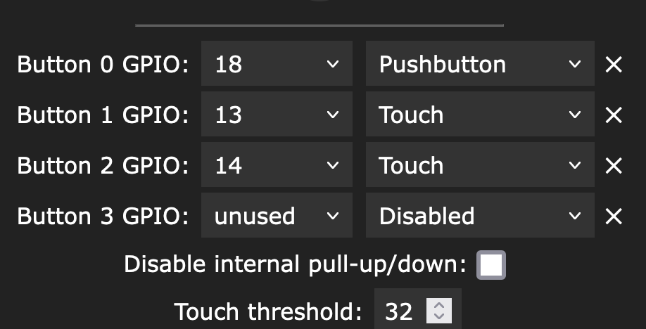

# Usermods Touch Buttons

With the Lolin ESP32s2mini the touch buttons don't work.
Reading with `int value = touchRead(pin)` the value is rising when touching the touch button. The value is ~15000 without touching. 

This usermod takes all defined touch buttons in Config->LED Preferences->Hardware setup

 and handles the touch if a value is bigger by 700 than the last value.

In this Example just Button 1 and 2 are handled in this usermod.

## Warning
Touch Buttons are only on Pin 2,4,12,13,14,15,27,32,33 possible. 

## Installation 

Uncomment the line `#define USERMOD_TOUCH_BUTTONS` in `usermods_list.cpp` and compile!  

## Button
Touch button definition for the BaernerZyt Usermod 

| Touch Button | ESP32 | Comment |
|-------|---|---|
| Alu/Cupper foil | Pin 13 | Preset 20 to change Brightness |
| Alu/Cupper foil | Pin 14 | Preset 30 to change Effect
